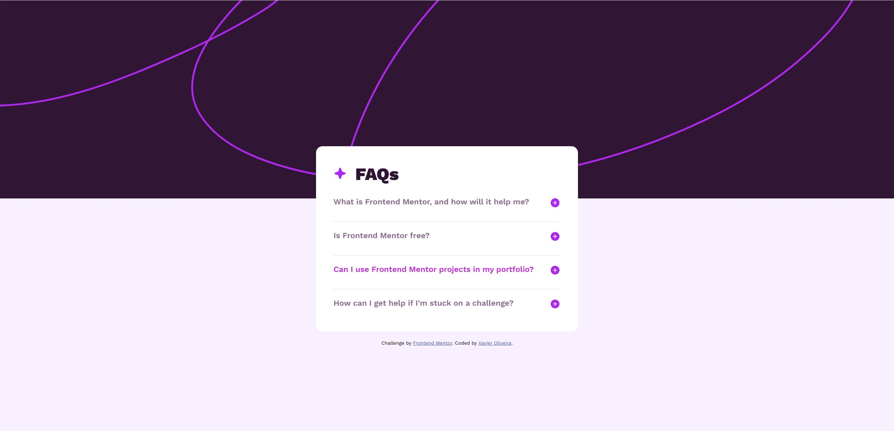
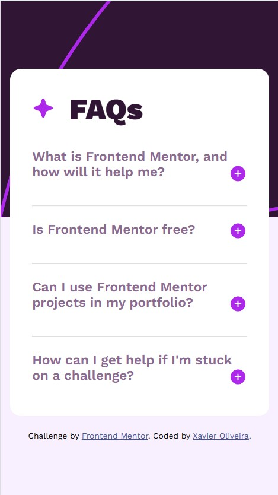

# Frontend Mentor - FAQ accordion solution

This is a solution to the [FAQ accordion challenge on Frontend Mentor](https://www.frontendmentor.io/challenges/faq-accordion-wyfFdeBwBz). Frontend Mentor challenges help you improve your coding skills by building realistic projects. 

## Table of contents

- [Overview](#overview)
  - [The challenge](#the-challenge)
  - [Screenshot](#screenshot)
  - [Links](#links)
- [My process](#my-process)
  - [Built with](#built-with)
  - [What I learned](#what-i-learned)
  - [Continued development](#continued-development)
  - [Useful resources](#useful-resources)
- [Author](#author)

## Overview

### The challenge

Users should be able to:

- Hide/Show the answer to a question when the question is clicked
- Navigate the questions and hide/show answers using keyboard navigation alone
- View the optimal layout for the interface depending on their device's screen size
- See hover and focus states for all interactive elements on the page

### Screenshot




### Links

- Solution URL: [Add solution URL here](https://github.com/OliveiraXavier14/Frontend-Mentor-Challenges)
- Live Site URL: [Add live site URL here](https://oliveiraxavier14.github.io/Frontend-Mentor-Challenges/)

## My process

### Built with

- Semantic HTML5 markup
- CSS custom properties
- Flexbox
- JavaScript

### What I learned
One of my major learning while working through this project was the use of method forEach. It was the first time that i use it and i learned how to work with it.

```css
@media (max-width: 375px) {
  body {
    display: flex;
  }

  #back-desktop {
    display: none;
  }
  #back-mobile {
    display: block;
  }

  #container {
    width: 90%;
    max-width: 350px;
    margin-top: -200px;
  }

  .icon {
    width: 24px;
  }

  .accordion-body {
    font-size: 14px;
  }
  .accordion-body.active {
    height: auto;
  }
}
```
```js
accordions.forEach((accordion) => {
  accordion.addEventListener('click', () => {
    const body = accordion.nextElementSibling;
    body.classList.toggle('active');
    
    const icon = accordion.querySelector('.icon')

    if (body.classList.contains('active')){
      icon.src = 'assets/images/icon-minus.svg'
    }else {
      icon.src = 'assets/images/icon-plus.svg'
    }
  });
});
```


### Continued development
Some aspects that i´m not totally comfortable with and i want to improve in the future is the use of @media and how i can turn a website more responsive.


### Useful resources

- (https://www.youtube.com/watch?v=kyFiT4ofMwk&t=113sm) - This helped me with @media. I really liked this method and will use it going forward.


## Author

- Frontend Mentor - [@OliveiraXavier14](https://github.com/OliveiraXavier14)


